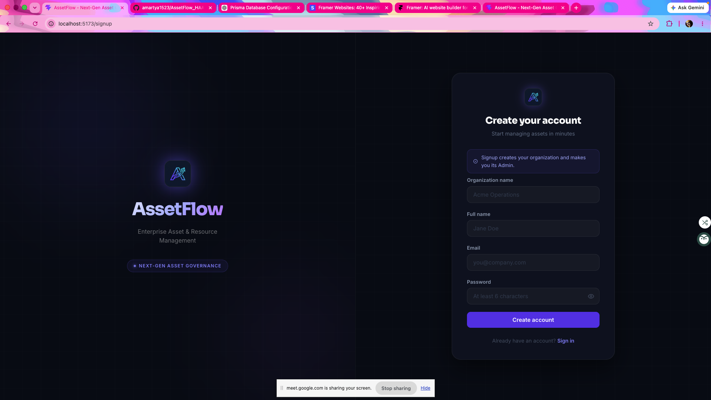
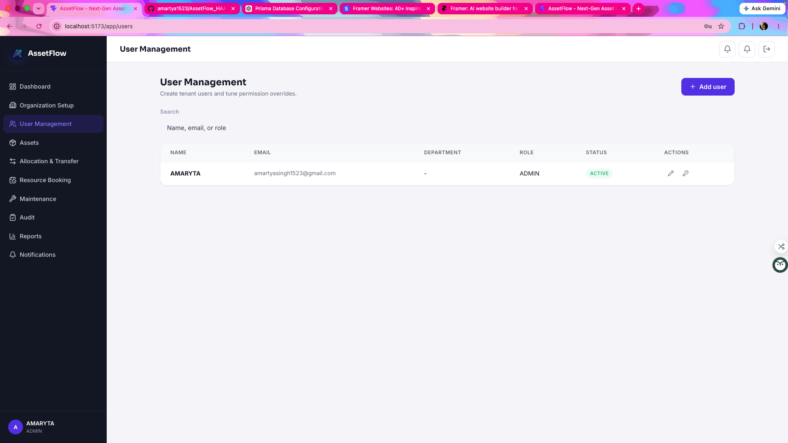
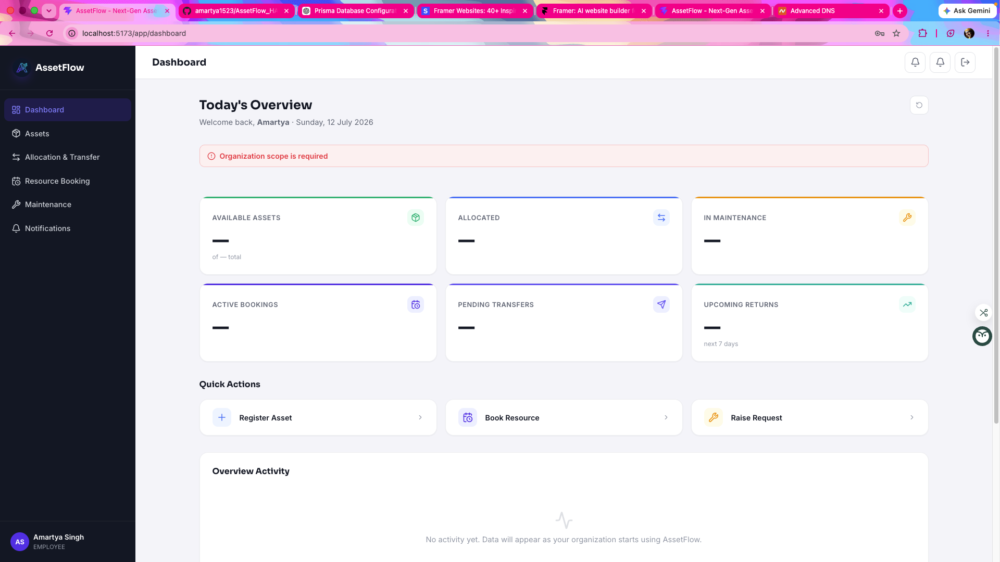
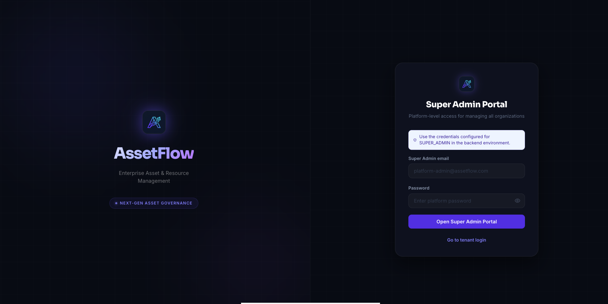
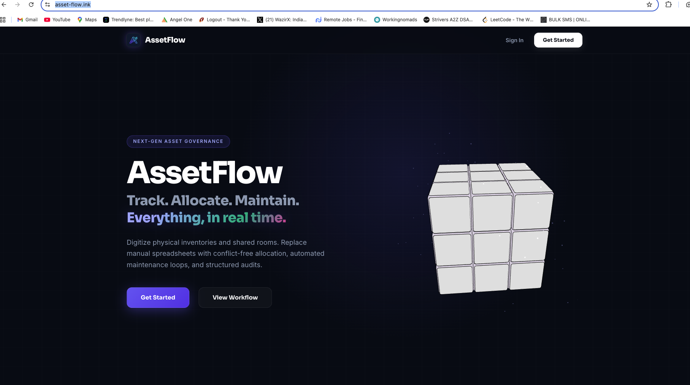

# AssetFlow

> Track it. Allocate it. Maintain it. Govern it.

AssetFlow is a multi-portal asset and resource governance platform built for the **Odoo Hackathon 2026**.  
It is designed around a simple real-world story:

- a company signs up for the first time
- that first user becomes the **tenant admin**
- the admin creates the organization structure and onboard users
- employees log in with their assigned access
- the platform owner manages every tenant separately from a dedicated **Super Admin Portal**

## Live Product

**Production URL:** [https://asset-flow.ink/](https://asset-flow.ink/)

---

## Why AssetFlow Exists

Most teams still manage assets, room bookings, handovers, audit trails, and maintenance requests across scattered spreadsheets, informal chats, and tribal knowledge. AssetFlow brings all of that into one structured flow:

- **Assets** are registered and tracked centrally
- **Allocations & transfers** are controlled instead of guessed
- **Resource bookings** avoid collisions
- **Maintenance** becomes a workflow, not a WhatsApp message
- **Audit and reporting** become visible, exportable, and repeatable

This is not just a dashboard project. It is a **role-aware admin system + employee workspace + platform-owner console**.

---

## The Product Story

### 1. A company arrives for the first time

When a user creates an account, they are not just creating a login.  
They are creating their **organization workspace** inside AssetFlow.

That signup flow automatically:

- creates the organization
- creates the first user
- makes that first user the **ADMIN**
- issues the token needed to enter the tenant app

This is the point where the tenant is born inside the system.



### 2. The admin sets up the workspace

Once inside, the admin gets access to the organization-side control surface.  
This is where the tenant starts shaping their own internal system:

- organization setup
- departments
- asset categories
- user management
- permission tuning
- bookable resources

The admin can create employee accounts, assign roles, and control who sees what.

Important implementation detail:

- tenant users are created from **User Management**
- a temporary password is generated on creation
- until invitation email delivery is added, that temporary password is logged by the backend



### 3. Employees do not see the same world as admins

This part matters a lot.

AssetFlow is not a one-dashboard-for-everyone app.  
The **employee experience** is intentionally different from the **admin experience**.

Employees get the operational side:

- personal dashboard
- assets they interact with
- transfer-related flows
- bookings
- maintenance requests
- notifications

Admins get everything employees get, plus governance capabilities like:

- organization setup
- user management
- administrative visibility
- tenant control



### 4. The platform owner lives outside tenant space

A tenant admin is powerful inside one organization.  
But the **site owner / platform operator** needs a totally separate access layer.

That is why AssetFlow includes a dedicated **Super Admin Portal**.

This portal is for:

- platform-level organization visibility
- cross-tenant control
- managing organizations from outside tenant boundaries

This is intentionally not mixed with normal tenant login.



### 5. The public-facing entry stays product-first

The landing experience introduces the system before the user enters any portal.  
It acts as the product face, the brand layer, and the first conversion step into signup/login.



---

## Portal Architecture

AssetFlow is split into three clear operating zones:

| Zone | Who uses it | What it is for |
| --- | --- | --- |
| Public Product Site | New visitors | Brand, product story, signup, login |
| Tenant Portal | Admins, asset managers, department heads, employees | Day-to-day asset and resource operations |
| Super Admin Portal | Platform owner | Organization-level platform control |

### Tenant-side roles

The tenant application supports these core roles:

- `ADMIN`
- `ASSET_MANAGER`
- `DEPARTMENT_HEAD`
- `EMPLOYEE`

### Platform role

- `SUPER_ADMIN`

`SUPER_ADMIN` is reserved for the platform owner and is intentionally kept outside regular tenant role assignment.

---

## What We Built

AssetFlow currently covers the full product journey across major enterprise operations:

### Tenant onboarding

- organization signup
- first-admin creation
- protected auth flow
- role-aware routing

### Organization control

- department management
- category management
- employee directory
- role updates
- permission overrides

### Asset operations

- asset registration
- asset listing and detail views
- update and history flows
- bookable vs non-bookable asset behavior

### Allocation and transfer

- asset allocation
- transfer requests
- transfer approvals
- operational status updates

### Resource booking

- booking creation
- overlap detection
- cancel/reschedule flow
- booking history
- resource quick-add flow

### Maintenance

- request raising
- approval states
- technician flow groundwork

### Audit, reports, notifications

- audit-related structure
- reporting services
- notification pipeline
- activity logging

---

## What Makes This Project Different

This project was built like a product system, not just a screen collection.

### Multi-tenant by design

Every meaningful operation is tied to organization scope.  
Tenant data is not supposed to leak across companies.

### Role-based experience, not just role labels

Roles are not decorative.  
They change routes, access, and control surfaces.

### Separate super admin boundary

The platform owner is not treated like “just another admin”.  
There is a distinct portal and access pattern for that role.

### Operational modules that connect to each other

Assets, bookings, transfers, maintenance, and audit flows are not random pages.  
They shape the lifecycle of a real-world company asset.

---

## A Quick Walkthrough

### If you are a new company

1. Visit [https://asset-flow.ink/](https://asset-flow.ink/)
2. Create your account
3. Your organization is created instantly
4. You enter the product as the first **Admin**

### If you are an admin

1. Create departments and categories
2. Add employees from **User Management**
3. Assign them roles
4. Register assets and mark bookable resources
5. Start allocations, transfers, bookings, and maintenance flows

### If you are an employee

1. Log in using the credentials created for you
2. Access your dashboard
3. Interact with assets, bookings, and requests based on your role

### If you are the platform owner

1. Open the **Super Admin Portal**
2. Sign in with `SUPER_ADMIN` credentials configured in backend environment
3. Manage the platform from outside tenant space

#### Super Admin Credentials

```env
SUPER_ADMIN_EMAIL=assets@gmail.com
SUPER_ADMIN_PASSWORD=admin@123
SUPER_ADMIN_NAME=Platform Admin
```

---

## Screens at a Glance

### Public / Auth

- Landing page
- Tenant signup
- Tenant login
- Super admin login

### Tenant app

- Dashboard
- Organization Setup
- User Management
- Assets
- Allocation & Transfer
- Resource Booking
- Maintenance
- Audit
- Reports
- Notifications

### Platform app

- Super Admin Portal
- Platform organization control

---

## Tech Stack

### Frontend

- React
- Vite
- React Router
- Zustand
- Framer Motion
- Axios

### Backend

- Node.js
- Express
- Prisma
- PostgreSQL
- JWT authentication

---

## Project Layout

```text
.
├── backend/
│   ├── prisma/
│   └── src/
│       ├── controllers/
│       ├── middleware/
│       ├── routes/
│       ├── services/
│       └── utils/
├── frontend/
│   ├── public/
│   └── src/
│       ├── api/
│       ├── components/
│       ├── context/
│       └── pages/
└── docs/
    └── screenshots/
```

---

## Local Run

### Backend

```bash
cd backend
npm install
npx prisma generate
npx prisma migrate dev
npm run dev
```

Backend runs on:

```text
http://localhost:5000
```

### Frontend

```bash
cd frontend
npm install
npm run dev
```

Frontend runs on:

```text
http://localhost:5173
```

---

## Final Note

AssetFlow was built as a full-stack hackathon product with real operational intent:

- tenant onboarding
- admin control
- employee access
- platform ownership

It is not only about “managing assets”.  
It is about building the structure around **who can create, assign, book, approve, maintain, audit, and govern them**.

**Built for the Odoo Hackathon 2026.**
